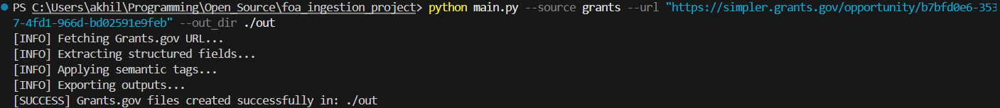
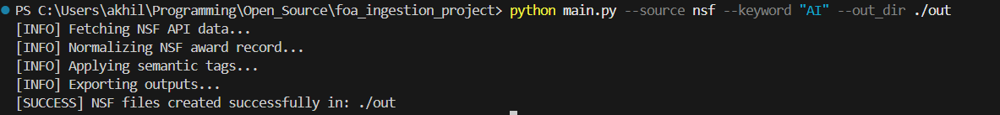
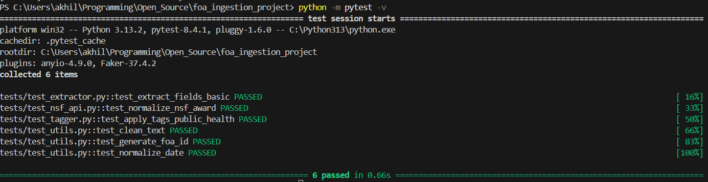

# FOA Ingestion + Semantic Tagging Screening Task
> A lightweight multi-source funding opportunity ingestion and semantic enrichment pipeline.
## Overview

This project implements a lightweight **Funding Opportunity Announcement (FOA) ingestion and normalization pipeline** designed for research funding discovery workflows.

The pipeline ingests funding-related records from **heterogeneous public sources**, extracts structured metadata, applies **deterministic semantic tags**, and exports the normalized output into machine-readable formats.

It currently supports:

- **Grants.gov** → HTML scraping workflow
- **NSF Awards API** → structured JSON ingestion workflow

The goal is to demonstrate a clean, extensible ingestion architecture that can later be expanded to support additional funding sources such as **NIH**, **NSF solicitations**, **federal grant portals**, or **PDF-based FOAs**.


## Contents

- [`architecture.md`](docs/architecture.md)  
  Overview of the project structure and module responsibilities.

- [`data_flow.md`](docs/data_flow.md)  
  End-to-end explanation of how data moves through the pipeline.

- [`tagging_logic.md`](docs/tagging_logic.md)  
  Explanation of the current semantic tagging approach.

- [`design_decisions.md`](docs/design_decisions.md)  
  Notes on engineering choices and implementation tradeoffs.

- [`limitations_and_next_steps.md`](docs/limitations_and_next_steps.md)  
  Current project limitations and realistic future improvements.


These docs are intended to make the current MVP easier to understand, maintain, and extend.

---

## Problem Statement

Funding opportunities are often published across different platforms with inconsistent formats:

- Some sources provide **HTML pages**
- Some provide **structured APIs**
- Some provide **PDF documents**
- Field names and data layouts vary significantly across sources

This project addresses that challenge by:

1. **Ingesting source-specific records**
2. **Normalizing them into a common schema**
3. **Applying semantic enrichment**
4. **Exporting structured outputs for downstream use**

---

## Features

- **Multi-source ingestion**
  - Grants.gov (HTML scraping)
  - NSF Awards API (JSON API ingestion)

- **Structured metadata extraction**
  - Title
  - Agency
  - Open / Close dates
  - Eligibility
  - Program description
  - Award amount
  - Source URL

- **Deterministic semantic tagging**
  - Research domains
  - Methods / approaches
  - Populations
  - Sponsor themes

- **Normalized output schema**
  - Consistent schema across heterogeneous sources

- **Export support**
  - JSON
  - CSV

- **Modular project structure**
  - Source-specific ingestion modules
  - Reusable utilities
  - Dedicated tagging and export layers

- **Automated tests**
  - Unit tests for extraction, normalization, tagging, and utilities

---

## Project Structure

```bash
foa_ingestion_project/
│
├── main.py
├── README.md
├── requirements.txt
│
├── out/
│   ├── grants_foa.csv
│   ├── grants_foa.json
│   ├── nsf_foa.csv
│   └── nsf_foa.json
│
├── src/
│   ├── extractor.py
│   ├── exporter.py
│   ├── parser.py
│   ├── tagger.py
│   ├── utils.py
│   └── sources/
│       ├── grants_gov.py
│       └── nsf_api.py
│
└── tests/
    ├── test_extractor.py
    ├── test_nsf_api.py
    ├── test_tagger.py
    └── test_utils.py
```

## Supported Sources

### 1) Grants.gov (HTML ingestion)

This source is ingested by scraping a public opportunity page and extracting relevant FOA-like metadata.

**Example:**
```
https://simpler.grants.gov/opportunity/<opportunity-id>
```

---

### 2) NSF Awards API (structured JSON ingestion)

This source is ingested via the official NSF API and normalized into the same output schema.

**Example:**
```
https://api.nsf.gov/services/v1/awards.json?keyword=AI
```

> **Note:**  
> The NSF API returns award records rather than raw FOA pages.  
> For this screening task, those records are used as a structured funding-data source to validate schema normalization and semantic tagging across heterogeneous inputs.

---

## Setup

### 1) Clone the repository

```bash
git clone https://github.com/AkhilHaroldPeter/foa_ingestion_project.git
cd foa_ingestion_project
```

---

### 2) Create and Activate Virtual Environment

Using a virtual environment is recommended.

#### Windows (PowerShell)
```bash
python -m venv venv
.\venv\Scripts\Activate.ps1
```

#### Windows (Command Prompt)
```bash
python -m venv venv
venv\Scripts\activate
```

#### macOS / Linux
```bash
python3 -m venv venv
source venv/bin/activate
```

When activated, your terminal should show:
```
(venv)
```

---

### 3) Install Dependencies

```bash
pip install -r requirements.txt
```

---

### Requirements

Example `requirements.txt`:

```
requests
beautifulsoup4
lxml
pandas
pytest
```

---

## Usage

### Run Grants.gov ingestion

```bash
python main.py --source grants --url "https://simpler.grants.gov/opportunity/b7bfd0e6-3537-4fd1-966d-bd02591e9feb" --out_dir ./out
```

**Expected console output:**
```
[INFO] Fetching Grants.gov URL...
[INFO] Extracting structured fields...
[INFO] Applying semantic tags...
[INFO] Exporting outputs...
[SUCCESS] Grants.gov files created successfully in: ./out
```

📸 Screenshot:
<!-- Insert screenshot of Grants.gov run output here -->




---

### Run NSF ingestion

```bash
python main.py --source nsf --keyword "AI" --out_dir ./out
```

**Expected console output:**
```
[INFO] Fetching NSF API data...
[INFO] Normalizing NSF award record...
[INFO] Applying semantic tags...
[INFO] Exporting outputs...
[SUCCESS] NSF files created successfully in: ./out
```

📸 Screenshot:

<!-- Insert screenshot of NSF run output here -->


---

## Run Tests

```bash
python -m pytest -v
```

**Expected output:**
```
tests/test_extractor.py::test_extract_fields_basic PASSED
tests/test_nsf_api.py::test_normalize_nsf_award PASSED
tests/test_tagger.py::test_apply_tags_public_health PASSED
tests/test_utils.py::test_clean_text PASSED
tests/test_utils.py::test_generate_foa_id PASSED
tests/test_utils.py::test_normalize_date PASSED
```

📸 Screenshot:

<!-- Insert screenshot of test execution here -->


---

## Output Files

The pipeline exports structured outputs to the `out/` directory.

### Example outputs
```
grants_foa.json
grants_foa.csv
nsf_foa.json
nsf_foa.csv
```

These outputs use a common normalized schema so records from different sources can be compared consistently.

---

## Normalized Output Schema

Each ingested record is normalized into the following schema:

```json
{
  "foa_id": "string",
  "title": "string",
  "agency": "string",
  "open_date": "YYYY-MM-DD",
  "close_date": "YYYY-MM-DD",
  "eligibility_text": "string",
  "program_description": "string",
  "award_range": "string",
  "source_url": "string",
  "tags": {
    "research_domains": [],
    "methods_approaches": [],
    "populations": [],
    "sponsor_themes": []
  }
}
```

---

## Example Output (Grants.gov)

```json
{
  "foa_id": "673316605e",
  "title": "Opportunity Listing - BJA FY25 Public Safety and Mental Health Initiative",
  "agency": "Grants.gov",
  "open_date": "2026-02-19",
  "close_date": "2026-03-30",
  "eligibility_text": "Government Federally recognized Native American tribal governments State governments...",
  "program_description": "This NOFO supports comprehensive service networks addressing untreated mental illness and substance use...",
  "award_range": "$3,000,000",
  "source_url": "https://simpler.grants.gov/opportunity/b7bfd0e6-3537-4fd1-966d-bd02591e9feb",
  "tags": {
    "research_domains": ["Public Health"],
    "methods_approaches": ["Intervention Study"],
    "populations": [],
    "sponsor_themes": ["Infrastructure"]
  }
}
```

---

## Example Output (NSF API)

```json
{
  "foa_id": "5db4f054ae",
  "title": "CAREER: Structure and Incentives for Eliciting and Aggregating Information",
  "agency": "NSF",
  "open_date": "2026-03-26",
  "close_date": "2031-09-30",
  "eligibility_text": "Not specified in NSF API record",
  "program_description": "People, organizations, and automated systems all need to base their decisions on information...",
  "award_range": "$743315",
  "source_url": "https://api.nsf.gov/services/v1/awards.json?keyword=AI",
  "tags": {
    "research_domains": ["Artificial Intelligence", "Public Health", "Education"],
    "methods_approaches": [],
    "populations": [],
    "sponsor_themes": []
  }
}
```

---

## Semantic Tagging Approach

This project uses a **rule-based deterministic tagging strategy** for reproducibility and interpretability.

Tags are assigned by matching funding descriptions against curated keyword groups.

### Example semantic categories

#### Research Domains
- Artificial Intelligence
- Public Health
- Education

#### Methods / Approaches
- Intervention Study
- Machine Learning
- Data Infrastructure

#### Populations
- Children
- Older Adults
- Rural Communities

#### Sponsor Themes
- Workforce Development
- Infrastructure
- Equity

---

### Why deterministic tagging?

For an MVP, deterministic tagging is:

- Easy to explain
- Reproducible
- Testable
- Lightweight
- Easy to extend later

---

## Testing

This project includes unit tests for:

- Text cleaning
- Date normalization
- FOA ID generation
- Grants.gov field extraction
- NSF record normalization
- Semantic tagging

### Current test coverage includes:
- `test_extract_fields_basic`
- `test_normalize_nsf_award`
- `test_apply_tags_public_health`
- `test_clean_text`
- `test_generate_foa_id`
- `test_normalize_date`

---

## Design Decisions

### Why separate source modules?

Each funding source exposes data differently:

- HTML pages → scraping / extraction logic  
- APIs → structured JSON  

To keep the code maintainable, ingestion is split into:

```
src/sources/grants_gov.py
src/sources/nsf_api.py
```

This makes it easy to add future sources such as:

- NIH Reporter
- NSF solicitations
- Agency PDF FOAs
- University grant pages

---

## Assumptions / Limitations

- Processes one record at a time
- Grants.gov extraction is format-specific
- NSF uses award records as proxy data
- PDF ingestion not implemented
- Tagging is rule-based (no embeddings / LLM yet)
- No batch export yet

---

## Future Improvements

- Add NIH and other portals
- Add batch ingestion
- Combined multi-record export
- PDF parsing
- Embedding-based tagging
- Ontology expansion
- Tagging evaluation metrics
- Scheduled ingestion workflows
- Database persistence
- CLI bulk processing

---

## Why this project is useful

This project demonstrates a foundation for a research funding discovery pipeline:

- Multi-source ingestion
- Schema normalization
- Metadata enrichment
- Reproducible outputs
- Modular design
- Testability

### Enables future systems like:

- Funding search
- Grant recommendation
- Semantic indexing
- Research opportunity discovery
- Automated screening pipelines

---

## Author

**Akhil Harold Peter**